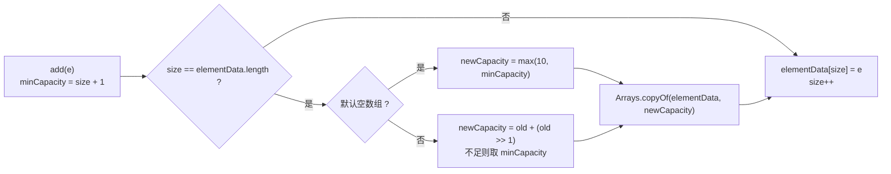

`List` 是 Java 集合框架中最常用的接口之一。日常开发里，分页结果、表单明细、订单列表、用户列表、配置项列表，很多数据都会用 `List` 承载。

如果只会写 `new ArrayList<>()`，很容易忽略几个关键问题：`List` 到底能存什么类型？`ArrayList` 和 `LinkedList` 应该怎么选？`ArrayList` 什么时候分配空间？为什么扩容有成本？遍历时为什么不能随便删除元素？

本文围绕这些问题展开，重点理解 `List` 的使用边界和 `ArrayList` 的底层机制。

## 一、List 能存储什么类型的数据

`List` 是一个泛型接口，常见形式如下：

```java
List<E>
```

这里的 `E` 表示元素类型。Java 集合存储的是对象引用，因此 `List` 不能直接存储基本类型，只能存储对象类型。

例如：

```java
List<String> names = new ArrayList<>();
List<Integer> numbers = new ArrayList<>();
List<User> users = new ArrayList<>();
```

其中 `Integer` 是 `int` 的包装类。下面这种写法是错误的：

```java
// 不能直接运行：泛型参数不能使用基本类型
// List<int> numbers = new ArrayList<>();
```

### 1.1 List 的基本特性

`List` 的核心特点如下：

| 特性 | 说明 |
| --- | --- |
| 有序 | 元素按照插入顺序保存 |
| 可重复 | 可以保存多个相同元素 |
| 可按下标访问 | 可以通过 `get(index)` 获取元素 |
| 可以保存 `null` | 大多数可变实现允许 `null`，但 `List.of()` 不允许 |
| 泛型约束元素类型 | 推荐写成 `List<String>`、`List<Integer>` 等明确类型 |

示例代码：

```java
package cn.probiecoder.week02;

import java.util.ArrayList;
import java.util.List;

public class ListBasicDemo {
    public static void main(String[] args) {
        List<String> names = new ArrayList<>();
        names.add("Alice");
        names.add("Bob");
        names.add("Alice");
        names.add(null);

        System.out.println(names);
        System.out.println("第一个元素：" + names.get(0));
        System.out.println("元素个数：" + names.size());

        List<Integer> scores = new ArrayList<>();
        scores.add(90);
        scores.add(95);
        System.out.println(scores);
    }
}
```

运行结果：

```text
[Alice, Bob, Alice, null]
第一个元素：Alice
元素个数：4
[90, 95]
```

这个例子说明了三件事：

- `List<String>` 只能保存字符串或 `null`。
- `List<Integer>` 保存的是 `Integer` 对象，`scores.add(90)` 会触发自动装箱。
- `ArrayList` 保持插入顺序，也允许重复元素。

## 二、List 的常见实现

`List` 是接口，本身不直接保存数据。真正负责存储元素的是它的实现类。

常见实现如下：

| 实现类                    | 底层结构        | 特点                       | 常见场景               |
| ---------------------- | ----------- | ------------------------ | ------------------ |
| `ArrayList`            | 动态数组        | 随机访问快，尾部追加快，中间插入删除需要移动元素 | 默认首选               |
| `LinkedList`           | 双向链表        | 头尾操作方便，随机访问慢，额外节点开销大     | 特定链表或双端队列场景        |
| `CopyOnWriteArrayList` | 写时复制数组      | 线程安全，读多写少                | 并发读多写少             |

日常开发中最常见的写法是：

```java
List<String> list = new ArrayList<>();
```

左边使用接口类型 `List`，右边使用具体实现 `ArrayList`。这样调用方依赖接口，后续如果确实需要替换实现，影响范围更小。

## 三、ArrayList 和 LinkedList 的区别

`ArrayList` 和 `LinkedList` 都实现了 `List` 接口，但它们的底层数据结构完全不同。

### 3.1 ArrayList：动态数组

`ArrayList` 底层使用数组保存元素，可以简化理解为：

```java
Object[] elementData;
int size;
```

数组支持通过下标直接访问，因此：

```java
list.get(index)
```

可以快速定位到数组中的某个位置，时间复杂度是 `O(1)`。

但数组长度固定，如果中间插入或删除元素，就需要移动后面的元素。例如删除下标 `1` 的元素：

```text
[A, B, C, D]
删除 B 后，需要把 C、D 向前移动
[A, C, D]
```

因此 `ArrayList` 的中间插入和删除通常是 `O(n)`。

### 3.2 LinkedList：双向链表

`LinkedList` 底层是双向链表，每个节点保存当前元素、前一个节点和后一个节点：

```java
E item;
Node<E> next;
Node<E> prev;
```

链表不支持像数组那样通过下标直接定位。调用：

```java
list.get(5)
```

时，`LinkedList` 需要从头或尾开始逐个节点查找，因此随机访问是 `O(n)`。

链表的优势在于：如果已经定位到节点，插入和删除只需要修改前后节点的引用。但在 Java 的 `LinkedList` 中，常见的 `add(index, element)`、`remove(index)` 仍然要先查找节点，这一步本身也是 `O(n)`。

### 3.3 如何选择

| 场景 | 推荐选择 | 原因 |
| --- | --- | --- |
| 普通业务列表 | `ArrayList` | 查询、遍历、追加表现稳定，内存开销较低 |
| 频繁按下标访问 | `ArrayList` | 数组随机访问是 `O(1)` |
| 主要尾部追加 | `ArrayList` | 均摊成本低 |
| 频繁中间插入删除 | 不要只凭感觉选 `LinkedList` | 找节点仍是 `O(n)`，需要结合真实场景测试 |
| 队列或双端队列 | `ArrayDeque` | 比 `LinkedList` 更适合作为队列默认选择 |
| 并发读多写少 | `CopyOnWriteArrayList` | 读操作无锁，写入复制数组 |

示例代码：

```java
package cn.probiecoder.week02;

import java.util.ArrayDeque;
import java.util.ArrayList;
import java.util.Deque;
import java.util.LinkedList;
import java.util.List;

public class ListImplementationDemo {
    public static void main(String[] args) {
        List<String> arrayList = new ArrayList<>();
        arrayList.add("A");
        arrayList.add("B");
        arrayList.add("C");

        List<String> linkedList = new LinkedList<>();
        linkedList.add("A");
        linkedList.add("B");
        linkedList.add("C");

        System.out.println("ArrayList 按下标读取：" + arrayList.get(1));
        System.out.println("LinkedList 按下标读取：" + linkedList.get(1));

        Deque<String> queue = new ArrayDeque<>();
        queue.addLast("task-1");
        queue.addLast("task-2");
        System.out.println("队列取出：" + queue.removeFirst());
    }
}
```

运行结果：

```text
ArrayList 按下标读取：B
LinkedList 按下标读取：B
队列取出：task-1
```

这个例子不是为了证明哪个类一定更快，而是强调接口语义：普通列表优先用 `ArrayList`；如果表达队列语义，优先用 `Deque` 和 `ArrayDeque`。

## 四、ArrayList 的初始容量与空间分配

`ArrayList` 有两个概念容易混淆：

| 概念 | 含义 |
| --- | --- |
| `size` | 当前已经保存的元素个数 |
| `capacity` | 底层数组能容纳的元素数量 |

`list.size()` 返回的是元素个数，不是底层数组容量。`ArrayList` 没有提供公开 API 直接查看容量。

### 4.1 默认构造方法不会马上分配 10 个空间

常见写法：

```java
List<String> list = new ArrayList<>();
```

在 JDK 8 及之后，默认构造方法不会立即创建长度为 `10` 的数组，而是先使用一个共享空数组。第一次添加元素时，才分配默认容量 `10`。

过程可以理解为：

```text
new ArrayList<>()
  -> size = 0
  -> capacity = 0

第一次 add()
  -> 发现容量不够
  -> 扩容到 10
  -> 写入第一个元素
```

如果明确指定初始容量：

```java
List<String> list = new ArrayList<>(20);
```

则会创建容量为 `20` 的底层数组。

### 4.2 扩容规则

`ArrayList` 添加元素时，如果当前数组容量不够，会触发扩容。正常情况下，新容量大约是旧容量的 `1.5` 倍。

旧版源码中可以看到类似逻辑：

```java
int newCapacity = oldCapacity + (oldCapacity >> 1);
```

其中：

```java
oldCapacity >> 1
```

等价于 `oldCapacity / 2`，所以新容量约等于：

```text
oldCapacity + oldCapacity / 2
```

默认构造下容量变化大致如下：

```text
0 -> 10 -> 15 -> 22 -> 33 -> 49 -> 73 -> 109
```

扩容流程可以用下面的流程图表示：



扩容不是在原数组上直接变大，而是：

1. 创建一个更大的新数组。
2. 把旧数组元素复制到新数组。
3. 让 `elementData` 指向新数组。
4. 旧数组等待垃圾回收。

因此，大量数据写入时，如果能提前估算数量，建议指定初始容量：

```java
List<Order> orders = new ArrayList<>(10000);
```

或提前调用：

```java
arrayList.ensureCapacity(10000);
```

### 4.3 用反射观察容量变化

下面的示例通过反射读取 `ArrayList` 内部的 `elementData` 数组长度。Java 9 之后模块系统默认不允许直接反射访问 `java.util` 的内部字段，运行时需要增加 `--add-opens` 参数。

```java
package cn.probiecoder.week02;

import java.lang.reflect.Field;
import java.util.ArrayList;

public class ArrayListCapacityDemo {
    public static void main(String[] args) throws ReflectiveOperationException {
        ArrayList<Integer> numbers = new ArrayList<>();
        System.out.println("创建后：size=" + numbers.size() + ", capacity=" + capacity(numbers));

        for (int i = 1; i <= 16; i++) {
            numbers.add(i);
            System.out.println("添加第 " + i + " 个元素后：size=" + numbers.size()
                    + ", capacity=" + capacity(numbers));
        }

        ArrayList<Integer> preset = new ArrayList<>(20);
        System.out.println("指定初始容量 20：size=" + preset.size() + ", capacity=" + capacity(preset));
    }

    private static int capacity(ArrayList<?> list) throws ReflectiveOperationException {
        Field field = ArrayList.class.getDeclaredField("elementData");
        field.setAccessible(true);
        Object[] elementData = (Object[]) field.get(list);
        return elementData.length;
    }
}
```

运行命令需要在 `base-java` 项目根目录执行，因为 `target/classes` 是相对项目根目录的路径。

```bash
java --add-opens java.base/java.util=ALL-UNNAMED \
  -cp target/classes cn.probiecoder.week02.ArrayListCapacityDemo
```

运行结果：

```text
创建后：size=0, capacity=0
添加第 1 个元素后：size=1, capacity=10
添加第 2 个元素后：size=2, capacity=10
添加第 3 个元素后：size=3, capacity=10
添加第 4 个元素后：size=4, capacity=10
添加第 5 个元素后：size=5, capacity=10
添加第 6 个元素后：size=6, capacity=10
添加第 7 个元素后：size=7, capacity=10
添加第 8 个元素后：size=8, capacity=10
添加第 9 个元素后：size=9, capacity=10
添加第 10 个元素后：size=10, capacity=10
添加第 11 个元素后：size=11, capacity=15
添加第 12 个元素后：size=12, capacity=15
添加第 13 个元素后：size=13, capacity=15
添加第 14 个元素后：size=14, capacity=15
添加第 15 个元素后：size=15, capacity=15
添加第 16 个元素后：size=16, capacity=22
指定初始容量 20：size=0, capacity=20
```

从输出可以看到：

- `new ArrayList<>()` 创建后容量是 `0`。
- 第一次添加元素后容量变成 `10`。
- 第 `11` 个元素触发扩容，容量从 `10` 变成 `15`。
- 第 `16` 个元素再次触发扩容，容量从 `15` 变成 `22`。
- `new ArrayList<>(20)` 会直接分配容量 `20`。

> 注意：反射读取 `elementData` 只是为了学习底层机制，业务代码不要依赖 `ArrayList` 的内部字段。

## 五、fail-fast 机制

`fail-fast` 是 Java 集合迭代器的一种快速失败机制。遍历集合时，如果集合结构被非预期修改，迭代器会尽快抛出：

```java
ConcurrentModificationException
```

以 `ArrayList` 为例，它内部维护了一个修改计数：

```java
protected transient int modCount = 0;
```

创建迭代器时，迭代器会记录当前修改次数：

```java
int expectedModCount = modCount;
```

遍历过程中会检查：

```java
if (modCount != expectedModCount) {
    throw new ConcurrentModificationException();
}
```

如果直接调用 `list.remove()`、`list.add()` 改变集合结构，`modCount` 会变化，但迭代器里的 `expectedModCount` 没有同步更新，于是触发 fail-fast。

> 注意：fail-fast 不是线程安全机制，它只是尽力尽早发现错误修改。不能依赖 `ConcurrentModificationException` 保证并发正确性。

## 六、迭代 List 时能不能修改

遍历时是否可以修改，要区分两类操作：

| 操作 | 是否推荐 | 原因 |
| --- | --- | --- |
| 修改元素对象的属性 | 可以 | 不改变 List 结构 |
| `set(index, value)` 替换元素 | 通常可以 | 不改变 List 长度 |
| 直接 `list.add()` | 不可以 | 结构性修改，可能 fail-fast |
| 直接 `list.remove()` | 不可以 | 结构性修改，可能 fail-fast |
| `Iterator.remove()` | 可以 | 迭代器会同步更新内部状态 |
| `ListIterator.set()` | 可以 | 专门用于遍历时替换 |
| `ListIterator.add()` | 可以 | 专门用于遍历时添加 |
| `removeIf()` | 可以 | 集合 API 提供的批量删除方式 |

示例代码：

```java
package cn.probiecoder.week02;

import java.util.ArrayList;
import java.util.ConcurrentModificationException;
import java.util.Iterator;
import java.util.List;
import java.util.ListIterator;

public class FailFastDemo {
    public static void main(String[] args) {
        directRemove();
        iteratorRemove();
        listIteratorUpdate();
        removeIfDemo();
    }

    private static void directRemove() {
        List<String> names = new ArrayList<>(List.of("A", "B", "C"));

        try {
            for (String name : names) {
                if ("A".equals(name)) {
                    names.remove(name);
                }
            }
        } catch (ConcurrentModificationException e) {
            System.out.println("直接 remove 触发 fail-fast");
        }
    }

    private static void iteratorRemove() {
        List<String> names = new ArrayList<>(List.of("A", "B", "C"));
        Iterator<String> iterator = names.iterator();

        while (iterator.hasNext()) {
            String name = iterator.next();
            if ("B".equals(name)) {
                iterator.remove();
            }
        }

        System.out.println("Iterator.remove 后：" + names);
    }

    private static void listIteratorUpdate() {
        List<String> names = new ArrayList<>(List.of("A", "B", "C"));
        ListIterator<String> iterator = names.listIterator();

        while (iterator.hasNext()) {
            String name = iterator.next();
            if ("B".equals(name)) {
                iterator.set("BB");
                iterator.add("B2");
            }
        }

        System.out.println("ListIterator 修改后：" + names);
    }

    private static void removeIfDemo() {
        List<String> names = new ArrayList<>(List.of("A", "B", "C"));
        names.removeIf(name -> "B".equals(name));
        System.out.println("removeIf 后：" + names);
    }
}
```

运行结果：

```text
直接 remove 触发 fail-fast
Iterator.remove 后：[A, C]
ListIterator 修改后：[A, BB, B2, C]
removeIf 后：[A, C]
```

这个例子可以总结出一个规则：遍历时不要直接改集合结构。如果要删除，用 `Iterator.remove()` 或 `removeIf()`；如果要边遍历边添加或替换，用 `ListIterator`。

## 七、ArrayList 常见注意事项

### 7.1 删除 Integer 元素时注意重载

`ArrayList` 有两个容易混淆的删除方法：

```java
remove(int index)
remove(Object o)
```

示例：

```java
List<Integer> numbers = new ArrayList<>(List.of(1, 2, 3));
numbers.remove(1);
System.out.println(numbers);
```

运行结果：

```text
[1, 3]
```

这里删除的是下标 `1` 的元素，也就是 `2`。如果要删除元素值 `1`，应该写成：

```java
numbers.remove(Integer.valueOf(1));
```

### 7.2 subList 是视图，不是独立副本

```java
List<String> list = new ArrayList<>(List.of("A", "B", "C"));
List<String> sub = list.subList(0, 2);
sub.set(0, "AA");

System.out.println(list);
```

输出是：

```text
[AA, B, C]
```

`subList()` 返回的是原列表的一段视图，修改视图会影响原列表。如果需要独立列表，应该复制一份：

```java
List<String> copy = new ArrayList<>(list.subList(0, 2));
```

### 7.3 Arrays.asList 和 List.of 的区别

`Arrays.asList()` 返回固定长度列表，不能增删：

```java
List<String> list = Arrays.asList("A", "B", "C");
// list.add("D"); // 运行时报 UnsupportedOperationException
```

如果要可增删，应该包一层 `ArrayList`：

```java
List<String> list = new ArrayList<>(Arrays.asList("A", "B", "C"));
```

`List.of()` 返回不可变列表，不允许增删，也不允许 `null`：

```java
List<String> list = List.of("A", "B", "C");
```

### 7.4 ArrayList 不是线程安全的

`ArrayList` 没有内置同步控制。多个线程同时修改同一个 `ArrayList`，可能出现数据丢失、异常或不一致结果。

常见替代方案：

| 场景 | 选择 |
| --- | --- |
| 少量同步访问 | `Collections.synchronizedList(new ArrayList<>())` |
| 读多写少 | `CopyOnWriteArrayList` |
| 更复杂的并发数据结构 | 根据业务选择 `ConcurrentHashMap`、阻塞队列等 |

不要因为 `Vector` 是同步的，就在新代码里优先使用它。`Vector` 是老旧集合实现，新项目通常使用更明确的并发工具。

### 7.5 转数组不要直接强转

错误写法：

```java
// 不能直接运行：toArray() 返回 Object[]
// String[] array = (String[]) list.toArray();
```

推荐写法：

```java
String[] array = list.toArray(new String[0]);
```

或者：

```java
String[] array = list.toArray(new String[list.size()]);
```

## 八、总结

`List` 和 `ArrayList` 的核心知识可以整理为下面这张表：

| 知识点 | 结论 |
| --- | --- |
| `List` 存储类型 | 存对象引用，泛型参数不能是基本类型 |
| 默认实现选择 | 普通业务列表优先用 `ArrayList` |
| `ArrayList` 底层 | 动态数组 |
| `LinkedList` 底层 | 双向链表 |
| 默认容量 | 默认构造时容量是 `0`，第一次添加时扩到 `10` |
| 扩容机制 | 容量不够时创建新数组并复制旧元素，通常扩到约 `1.5` 倍 |
| 查询性能 | `ArrayList.get(index)` 是 `O(1)` |
| 中间插入删除 | `ArrayList` 需要移动元素，通常是 `O(n)` |
| fail-fast | 迭代时结构性修改可能抛 `ConcurrentModificationException` |
| 遍历时删除 | 用 `Iterator.remove()` 或 `removeIf()` |
| 遍历时添加或替换 | 用 `ListIterator` |
| 线程安全 | `ArrayList` 不是线程安全集合 |

实际开发中可以先记住一条经验：**只要没有明确理由，普通列表默认使用 `ArrayList`；如果知道数据量，指定初始容量；遍历时不要直接结构性修改集合。**
